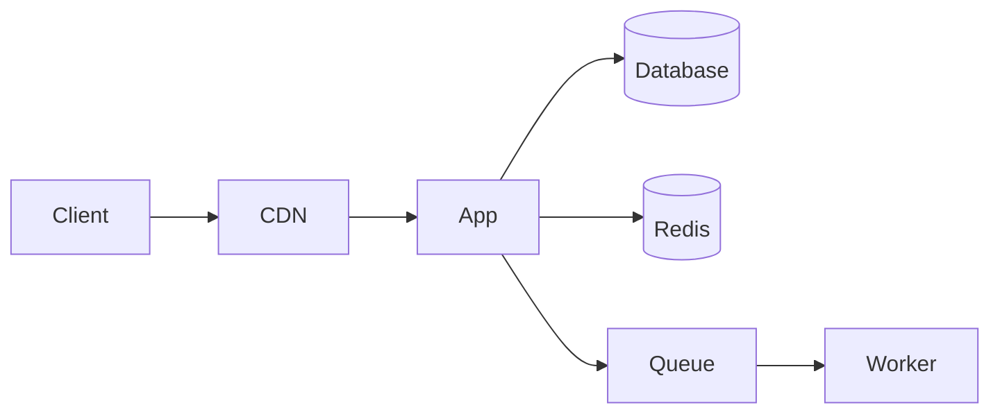

# Technology Stack Rules

> This rule defines the approved tech stack for the project.
> When proposing a new dependency, follow the decision criteria below.

---

## Project Stack (Configured)

> **IMPORTANT**: The stack below is configured for THIS project via CLI.
> If the project already has different dependencies in `package.json`, follow the EXISTING stack.

```
Frontend Framework:  {{frontendFramework}}
Design System:       {{designSystem}}
Styling:             {{styling}}
State Management:    {{stateManagement}}
Server State:        {{serverState}}
Backend Framework:   {{backendFramework}}
Language:            {{language}}
Database:            {{database}}
ORM:                 {{orm}}
Cache:               {{cache}}
Queue:               {{queue}}
Auth:                {{auth}}
Testing:             {{testing}}
E2E Testing:        {{e2eTesting}}
Logging:             {{logging}}
CI/CD:               {{cicd}}
Deployment:          {{deployment}}
```

---

## Technology Decision Process

### 🔴 MUST: Evaluate before adding ANY new dependency

| Criterion | Check |
|-----------|-------|
| **Necessity** | Does an approved alternative already solve this? |
| **Maintenance** | Stars > 1k? Last commit < 6 months? Active maintainers? |
| **Bundle size** | Check bundlephobia.com — is the KB justified? |
| **TypeScript** | Does it have native TS types? (not DefinitelyTyped) |
| **License** | MIT or Apache 2.0? (No GPL in commercial products) |
| **Security** | `npm audit` — zero high/critical vulnerabilities? |
| **Community** | Active issues? Stack Overflow answers? |
| **Alternatives** | Can we solve this with existing deps or native APIs? |

### Decision Template (for new dependencies)

```markdown
## Technology Decision: [Library Name]

**Problem**: What problem does this solve?
**Existing alternative**: What from current stack was considered?
**Why this is better**: Specific measurable reason
**Bundle impact**: +X KB (gzipped)
**Risk**: Known downsides, migration cost
**Decision**: ✅ Adopt / ❌ Reject
```

---

## Available Stack Options (CLI Selection Reference)

### Frontend Framework

| Option | Best For | SSR/SSG | Ecosystem |
|--------|----------|---------|-----------|
| Next.js 14+ (App Router) | SEO sites, full-stack | ✅ | React |
| Next.js (Pages Router) | Existing projects | ✅ | React |
| React + Vite | SPAs, admin panels | ❌ | React |
| Remix | Full-stack, forms-heavy | ✅ | React |
| Nuxt 3 | Vue full-stack | ✅ | Vue |
| Vue 3 + Vite | Vue SPAs | ❌ | Vue |
| SvelteKit | Performance-critical | ✅ | Svelte |
| Astro | Content sites, blogs | ✅ | Multi |
| Angular | Enterprise, large teams | ✅ | Angular |

### Backend Framework

| Option | Best For | Performance | Learning Curve |
|--------|----------|-------------|---------------|
| Express.js | General purpose, huge ecosystem | Medium | Low |
| Fastify | Performance-critical APIs | High | Low |
| Hono | Edge/serverless, lightweight | Very High | Low |
| NestJS | Enterprise, structured, DI | Medium | High |
| Next.js API Routes | Full-stack Next.js apps | Medium | Low |
| Elysia (Bun) | Bun runtime, type-safe | Very High | Medium |

### Database

| Option | Best For | Type |
|--------|----------|------|
| PostgreSQL | General purpose, relational | SQL |
| MySQL | Legacy, WordPress ecosystem | SQL |
| MongoDB | Document-heavy, flexible schema | NoSQL |
| SQLite | Embedded, dev/testing, edge | SQL |
| PlanetScale | Serverless MySQL, branching | SQL |
| Supabase | PostgreSQL + realtime + auth | SQL |

### ORM / Query Builder

| Option | Best For | Type Safety | Migration |
|--------|----------|-------------|-----------|
| Prisma | Type-safe, great DX | Excellent | Built-in |
| Drizzle | Lightweight, SQL-like | Excellent | Built-in |
| TypeORM | Decorator-based (NestJS) | Good | Built-in |
| Kysely | Type-safe query builder | Excellent | Manual |
| Sequelize | Legacy projects | Moderate | Built-in |

### Auth

| Option | Best For | Self-hosted |
|--------|----------|-------------|
| JWT + bcrypt | Custom auth, full control | ✅ |
| NextAuth (Auth.js) | Next.js projects, OAuth | ✅ |
| Lucia | Lightweight, session-based | ✅ |
| Passport.js | Express, many strategies | ✅ |
| Clerk | Managed, fast setup | ❌ (SaaS) |
| Supabase Auth | Supabase projects | ❌ (SaaS) |

---

## Rules for Stack Usage

### 🔴 MUST: Use configured stack — no unauthorized alternatives

```typescript
// If project uses Prisma, NEVER introduce TypeORM
// If project uses Zustand, NEVER introduce Redux
// If project uses Vitest, NEVER introduce Jest
```

### � MUST: One tool per job — no duplicates

```
❌ Bad: axios + fetch + got (3 HTTP clients)
✅ Good: Pick one and use it everywhere
```

### 🟡 SHOULD: Prefer native APIs when sufficient

```typescript
// ❌ Installing lodash for one function
import { debounce } from 'lodash';

// ✅ Use native or write a 5-line utility
function debounce(fn: Function, ms: number) { ... }
```

### 🟡 SHOULD: Pin dependency versions

```json
// ❌ Bad — unpredictable updates
"dependencies": {
  "express": "^4.18.0"
}

// ✅ Good — exact versions
"dependencies": {
  "express": "4.18.2"
}
```

---

## Documentation Requirements

### 🔴 MUST: Every project has

| Document | Location | Content |
|----------|----------|---------|
| README.md | Root | Setup, run, deploy instructions |
| .env.example | Root | All env vars with descriptions |
| API docs | `/api-docs` or `docs/api/` | OpenAPI/Swagger |
| Architecture | `docs/architecture/` | System diagrams (Mermaid) |

### 🟡 SHOULD: Use Mermaid for diagrams (version-controlled)


